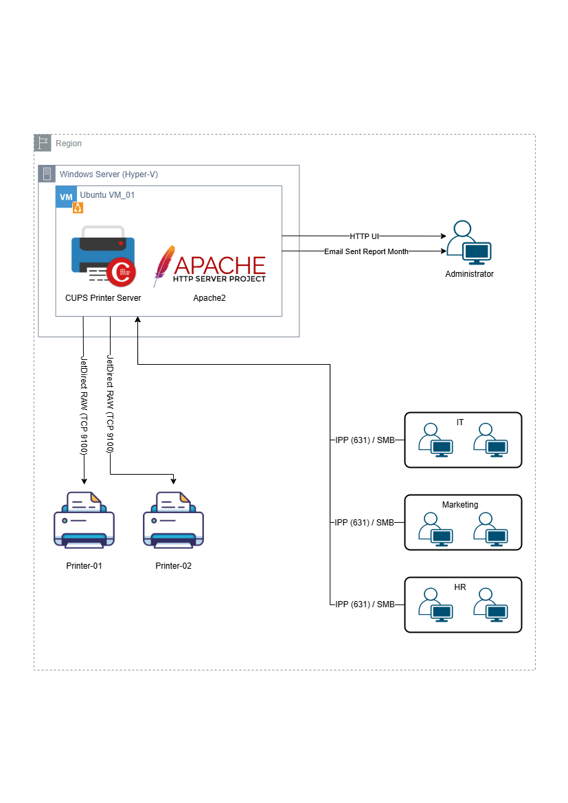

# Centralized Printing Management System

---

# 1. Project Overview

This project implements a **centralized printing management system** using **CUPS (Common Unix Printing System)** deployed on an **Ubuntu virtual machine** running on **Hyper-V**.

The system allows multiple departments to print through a centralized print server while administrators can monitor printing activity via a **web interface** and receive **automated monthly usage reports via email**.

This architecture improves:

* Print management
* Resource control
* Usage monitoring
* Operational efficiency
* Reduce operating costs
* Use the multifunction printing feature for OS/WINDOWS operating systems.

## Virtual Machine

### Ubuntu_VM_01

Services deployed:

* CUPS Print Server
* Apache2 Web Server
* Print Log Parser
* Automated Reporting System
---

# 2. System Architecture



The architecture consists of a centralized print server connected to network printers and client workstations across multiple departments.

---

# 3. Printing System

## Print Server

The printing system is managed by **CUPS**, which handles:

* Printer queue management
* Job scheduling
* Print job logging
* Client connections

---

# 4. Printing Workflow

1. User sends a print job from workstation

2. Job is transmitted to the **CUPS Print Server**

Protocols used:

* IPP
* SMB

3. CUPS processes the job and places it in the print queue

4. The server forwards the job to the printer via:

```
JetDirect RAW (TCP 9100)
```

5. Printer executes the job

6. Print logs are recorded for reporting and monitoring

---

# 5. Print Monitoring & Reporting

The system collects printing logs and generates **monthly usage reports**.

Features include:

* Print job tracking
* User activity logging
* Monthly usage reports
* Automated email reporting
* Web dashboard for administrators

Reports allow administrators to:

* Monitor printer usage
* Track department printing activity
* Detect excessive printing

---

# 6. Web Management Interface

The web interface is hosted using **Apache2**.

Administrator capabilities:

* View printing logs
* Access usage reports
* Monitor printer activity
* Download monthly reports

Access method:

```
HTTP Web Interface
```

---

# 7. Automated Email Reporting

The system automatically generates **monthly printing reports** and sends them to the administrator via email.

Report includes:

* Export file CSV & PDF
* Total print jobs
* Printer usage
* Department usage
* Activity statistics

---

# 8. Technology Stack

| Layer              | Technology          |
| ------------------ | ------------------- |
| Virtualization     | Hyper-V             |
| Operating System   | Ubuntu Server       |
| Print Server       | CUPS                |
| Web Server         | Apache2             |
| Protocols          | IPP, SMB, JetDirect |
| Reporting          | Custom Log Parser   |
| Email Notification | Mail System         |

---

# Author

**Truong Quang Phuc**

---
