# System Setup Guide

This guide describes the steps required to deploy the centralized printing system using CUPS and Apache.

---

# 1. Install Ubuntu Server

Recommended configuration:

* CPU: 2 cores
* RAM: 4 GB
* Disk: 40 GB
* Ubuntu Server 22.04 LTS

---

# 2. Update & Install Packages

* The "mailutils" package is an optional add-on that allows you to configure email sending.

```bash
apt update

timedatectl set-timezone Asia/Ho_Chi_Minh

apt install -y \
apache2 \
php \
php-cli \
cups \
cups-client \
logrotate \
mailutils
```

* Next:

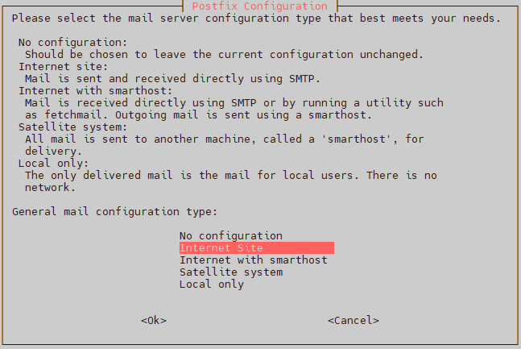

* Hostname Server:

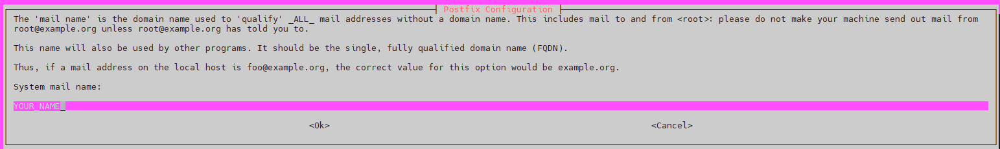


* Enable Service Apache & Cups:

```bash
sudo systemctl enable apache2
sudo systemctl enable cups
```

---

# 3. Config CUPS

```bash
nano /etc/cups/cupsd.conf
```

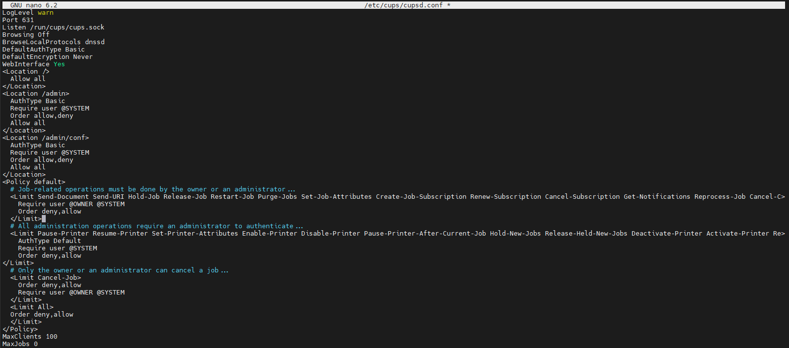

Code:
```bash
LogLevel warn
Port 631
Listen /run/cups/cups.sock
Browsing Off
BrowseLocalProtocols dnssd
DefaultAuthType Basic
DefaultEncryption Never
WebInterface Yes
<Location />
  Allow all
</Location>
<Location /admin>
  AuthType Basic
  Require user @SYSTEM
  Order allow,deny
  Allow all
</Location>
<Location /admin/conf>
  AuthType Basic
  Require user @SYSTEM
  Order allow,deny
  Allow all
</Location>
<Policy default>
  # Job-related operations must be done by the owner or an administrator...
  <Limit Send-Document Send-URI Hold-Job Release-Job Restart-Job Purge-Jobs Set-Job-Attributes Create-Job-Subscription Renew-Subscription Cancel-Subscription Get-Notifications Reprocess-Job Cancel-C>
    Require user @OWNER @SYSTEM
    Order deny,allow
  </Limit>
  # All administration operations require an administrator to authenticate...
  <Limit Pause-Printer Resume-Printer Set-Printer-Attributes Enable-Printer Disable-Printer Pause-Printer-After-Current-Job Hold-New-Jobs Release-Held-New-Jobs Deactivate-Printer Activate-Printer Re>
    AuthType Default
    Require user @SYSTEM
    Order deny,allow
</Limit>
  # Only the owner or an administrator can cancel a job...
  <Limit Cancel-Job>
    Order deny,allow
    Require user @OWNER @SYSTEM
  </Limit>
  <Limit All>
  Order deny,allow
  </Limit>
</Policy>
MaxClients 100
MaxJobs 0
```

* Restart Service:
```bash
sudo systemctl restart cups
```

* Add User to Lpadmin:
```bash
sudo usermod -aG lpadmin your_user
```

* Open Port:

80 (Web Dashboard)
631 (CUPS)

```bash
ufw allow 80
ufw allow 631
```

# 4. Log Rotation Configuration

* Edit time save log rotate 7 change to 60

```bash
sudo nano /etc/logrotate.d/cups-daemon
```

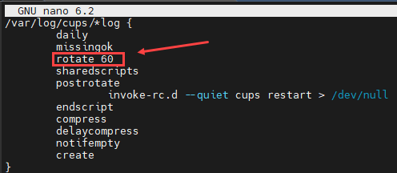

# 5. Create Dashboard Directory
* Create Dashboard Management:

```bash
mkdir -p /var/www/html/cups-report
cd /var/www/html/cups-report
```

* Create File:

```bash
touch parser.php index.php cache.json
```

* Grand Access File/Folder:

```bash
sudo chown -R www-data:www-data /var/www/html/cups-report
sudo chmod -R 755 /var/www/html/cups-report
sudo chmod 664 /var/www/html/cups-report/cache.json
```

* Grand User Read File:

```bash
sudo usermod -aG adm www-data
```

* Insert Code To parser:
```bash
nano parser.php
```

* Code:
```bash
<?php

$cache="/var/www/html/cups-report/cache.json";

$data=["details"=>[]];

$logs=glob("/var/log/cups/page_log*");

foreach($logs as $log){

if(!file_exists($log)) continue;

if(substr($log,-3)==".gz"){
$lines=explode("\n",shell_exec("zcat $log"));
}else{
$lines=file($log);
}

foreach($lines as $line){

if(!preg_match('/^(.*?) (.*?) (\d+) \[(.*?)\] total (\d+) - ([^ ]+) (.*?) - -$/',$line,$m))
continue;

$printer=$m[1];
$user=$m[2];
$datetime=$m[4];
$pages=$m[5];
$ip=$m[6];
$file=$m[7];

$dt=DateTime::createFromFormat("d/M/Y:H:i:s O",$datetime);

if(!$dt) continue;

$data["details"][]=[

"date"=>$dt->format("Y-m-d"),
"time"=>$dt->format("H:i:s"),
"printer"=>$printer,
"user"=>$user,
"ip"=>$ip,
"file"=>$file,
"pages"=>$pages

];

}

}

file_put_contents($cache,json_encode($data,JSON_PRETTY_PRINT));

?>
```

* Insert code to index:

```bash
nano index.php
```

* Code:
```bash
<?php

$json=file_exists("cache.json") ?
json_decode(file_get_contents("cache.json"),true):[];

$all=$json['details'] ?? [];

$month=$_GET['month'] ?? date("Y-m");
$search=strtolower($_GET['search'] ?? "");

$details=[];

foreach($all as $d){

if(substr($d['date'],0,7)!=$month) continue;

$text=strtolower(
$d['user'].$d['printer'].$d['ip'].$d['file']
);

if($search && strpos($text,$search)===false)
continue;

$details[]=$d;

}

usort($details,function($a,$b){
return strtotime($b['date']." ".$b['time'])
-
strtotime($a['date']." ".$a['time']);
});

# --------------------
# PAGINATION
# --------------------

$perPage=10;

$total=count($details);

$page=isset($_GET['page'])?(int)$_GET['page']:1;

if($page<1)$page=1;

$start=($page-1)*$perPage;

$detailsPage=array_slice($details,$start,$perPage);

$totalPages=ceil($total/$perPage);

# --------------------

$users=[];
$printers=[];
$hours=[];
$days=[];

foreach($details as $d){

$users[$d['user']] =
($users[$d['user']] ?? 0) + $d['pages'];

$printers[$d['printer']] =
($printers[$d['printer']] ?? 0) + $d['pages'];

$h=date("H",strtotime($d['time']));
$hours[$h]=($hours[$h] ?? 0)+$d['pages'];

$day=$d['date'];
$days[$day]=($days[$day] ?? 0)+$d['pages'];

}

arsort($users);
arsort($printers);
ksort($hours);
ksort($days);

if(isset($_GET['export'])){

header("Content-Type:text/csv");
header("Content-Disposition:attachment;filename=cups_report.csv");

echo "Date,Time,Printer,User,IP,File,Pages\n";

foreach($details as $d){

echo "{$d['date']},{$d['time']},{$d['printer']},{$d['user']},{$d['ip']},{$d['file']},{$d['pages']}\n";

}

exit;

}

?>

<!DOCTYPE html>
<html>

<head>

<title>Print Dashboard</title>

<meta http-equiv="refresh" content="30">

<script src="https://cdn.jsdelivr.net/npm/chart.js"></script>

<style>

body{
font-family:Arial;
background:#f3f3f3;
margin:40px;
}

h1,h2{
text-align:center;
}

table{
border-collapse:collapse;
margin:auto;
width:90%;
background:white;
margin-bottom:20px;
}

th,td{
padding:8px;
border:1px solid #ddd;
text-align:center;
}

th{
background:#333;
color:white;
}

.controls{
text-align:center;
margin-bottom:25px;
}

.controls input{
padding:6px;
margin-right:10px;
}

.controls button{
padding:6px 12px;
cursor:pointer;
}

.chart{
width:700px;
margin:auto;
margin-bottom:50px;
}

.pagination{
text-align:center;
margin-bottom:40px;
}

.pagination a{
padding:6px 10px;
border:1px solid #ccc;
margin:3px;
text-decoration:none;
color:black;
}

.pagination a.active{
background:#333;
color:white;
}

</style>

</head>

<body>

<h1>Print Dashboard</h1>

<div class="controls">

<form>

<input type="month" name="month"
value="<?php echo $month;?>">

<input type="text" name="search"
placeholder="Search user / printer / IP / file"
value="<?php echo $_GET['search'] ?? '';?>">

<button>View</button>

<a href="?month=<?php echo $month ?>&search=<?php echo $search ?>&export=1">
<button type="button">Export Excel</button>
</a>

</form>

</div>

<h2>Print Details</h2>

<table>

<tr>
<th>Date</th>
<th>Time</th>
<th>Printer</th>
<th>User</th>
<th>IP</th>
<th>File</th>
<th>Pages</th>
</tr>

<?php

foreach($detailsPage as $d){

echo "<tr>
<td>{$d['date']}</td>
<td>{$d['time']}</td>
<td>{$d['printer']}</td>
<td>{$d['user']}</td>
<td>{$d['ip']}</td>
<td>{$d['file']}</td>
<td>{$d['pages']}</td>
</tr>";

}

?>

</table>

<div class="pagination">

<?php

if($page>1){

$prev=$page-1;

echo "<a href='?month=$month&search=$search&page=$prev'>Prev</a>";

}

for($i=1;$i<=$totalPages;$i++){

$class=$i==$page?"active":"";

echo "<a class='$class'
href='?month=$month&search=$search&page=$i'>$i</a>";

}

if($page<$totalPages){

$next=$page+1;

echo "<a href='?month=$month&search=$search&page=$next'>Next</a>";

}

?>

</div>

<h2>Top Users</h2>

<table>
<tr><th>User</th><th>Totals</th></tr>

<?php

foreach($users as $u=>$c){

echo "<tr><td>$u</td><td>$c</td></tr>";

}

?>

</table>

<div class="chart">
<canvas id="userChart"></canvas>
</div>

<h2>Top Printers</h2>

<table>
<tr><th>Printer</th><th>Totals</th></tr>

<?php

foreach($printers as $p=>$c){

echo "<tr><td>$p</td><td>$c</td></tr>";

}

?>

</table>

<div class="chart">
<canvas id="printerChart"></canvas>
</div>

<div class="chart">

<h2>Printing by Hour</h2>

<canvas id="hourChart"></canvas>

</div>

<div class="chart">

<h2>Printing by Day</h2>

<canvas id="dayChart"></canvas>

</div>

<script>

new Chart(document.getElementById("userChart"),{

type:'bar',

data:{
labels:<?php echo json_encode(array_keys($users));?>,
datasets:[{
label:'Pages',
data:<?php echo json_encode(array_values($users));?>
}]
}

});

new Chart(document.getElementById("printerChart"),{

type:'pie',

data:{
labels:<?php echo json_encode(array_keys($printers));?>,
datasets:[{
data:<?php echo json_encode(array_values($printers));?>
}]
}

});

new Chart(document.getElementById("hourChart"),{

type:'line',

data:{
labels:<?php echo json_encode(array_keys($hours));?>,
datasets:[{
label:'Pages',
data:<?php echo json_encode(array_values($hours));?>
}]
}

});

new Chart(document.getElementById("dayChart"),{

type:'line',

data:{
labels:<?php echo json_encode(array_keys($days));?>,
datasets:[{
label:'Pages',
data:<?php echo json_encode(array_values($days));?>
}]
}

});

</script>

</body>
</html>
```

# 6. Setup Cron Jobs

```bash
crontab -e
```

* Insert:
```bash
* * * * * php /var/www/html/cups-report/parser.php
```

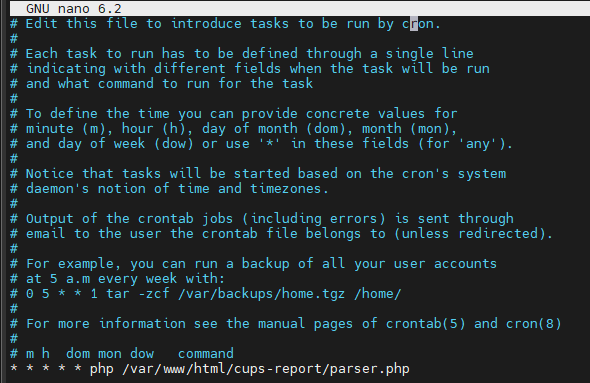

# 7. Add Printer

* Access Web Admin:

```bash
http://IP:631/admin
```

* Login User/Password:

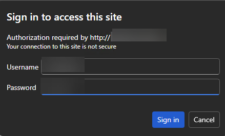

* Next:

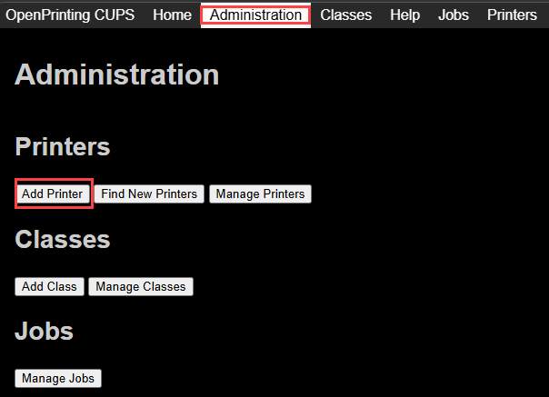

* Select Driver Printer:

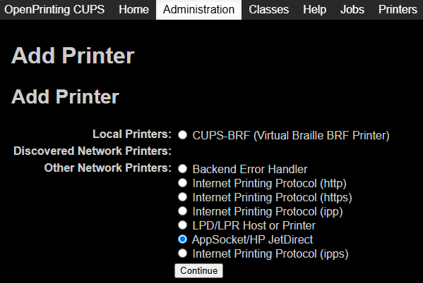

* Connection:

```bash
socket://IP-Printer
```

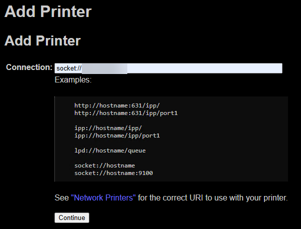

* Insert Informations:
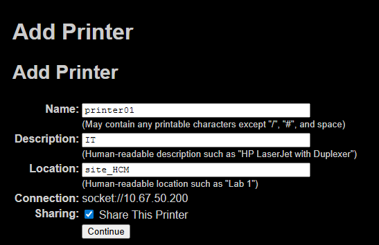

* Select Driver Fit:

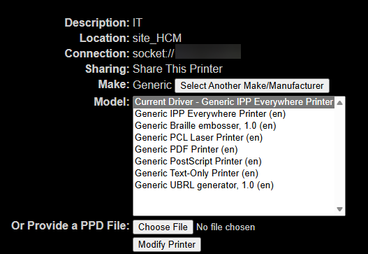

* Test Page:

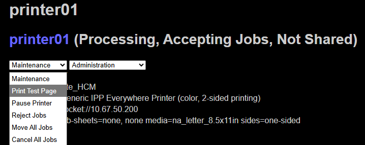

* Check Log:
```bash
tail -f /var/log/cups/access_log
```

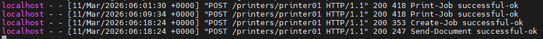

* Access Web Report Check:
```bash
http://IP/cups-report/
```

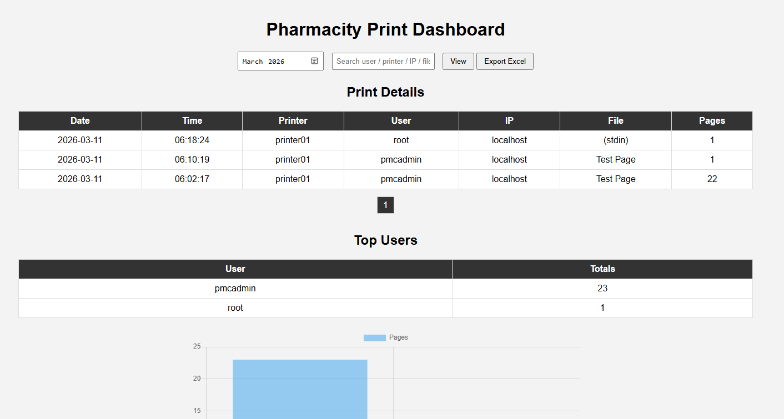
